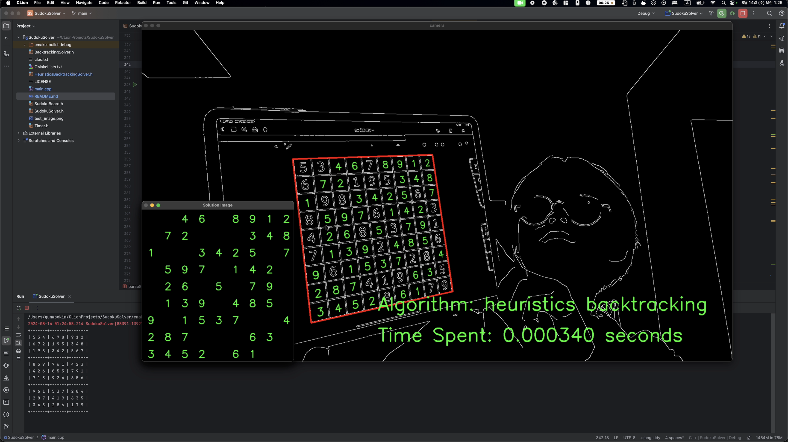

# Sudoku Solver: Heuristics Algorithm and Crook's Algorithm Implementation.

(click to see the video)  

Sudoku is a famous NP Complete problem.  

I was solving it with ordinary backtracking, but I was curious of other algorithms, and I felt like
_~~I needed some intellectual challenge these days~~_. Thus, I decided to implement different algorithms and compare.

SudokuSolver class is interface. Solver algorithms are implemented as its child classes.

- `BacktrackingSolver`- uses classic backtracking.
- `HeuristicsBacktrackingSolver` - combines **heuristics (Naked Single/Tuple Hidden Single/Tuple rules)** with **backtracking for constraint propagation**. this enables us to figure out what can be humanly figured out, and then rely on backtracking
- more yet to come... I guess

I saw some Neurodynamic Algorithms based on discrete Hopfield Networks or Boltzmann Machines. But
I'm not confident doing ML in C++, therefore, I'm not implementing those.

Just to have some visual interface, I used OpenCV as well.

---

**Lines of Code: `1118 lines`**
